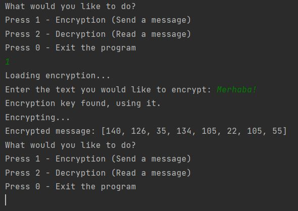

# Cryptography
A simple Java program to encrypt and decrypt messages using randomly generated encryption key files.

Features:
1. Encrypting a message with a generated encryption key. If encryption key does not exist, it automatically creates a random key.
2. Decrypting an encrypted message with a generated encryption key. (soon)

Future improvements:
1. Special characters (different letters from different languages such as Turkish, Russian and Japanese etc.) will be added.
2. ...

